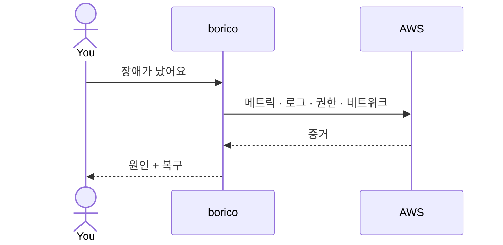
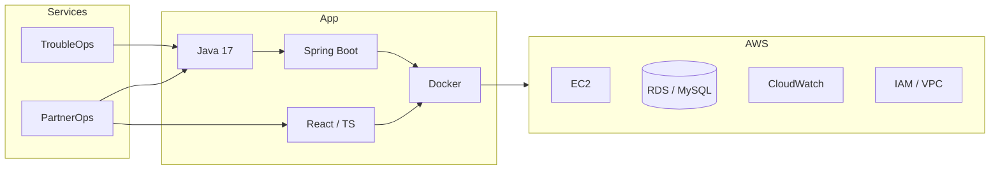

# borico

Cloud Ops Engineer.

장애는 재현해서 보고, 운영은 자동화합니다.

---

## Runtime

---

## Services

<table>
<tr>
<td width="50%" valign="top">

### [TroubleOps](https://github.com/tagmach11/TroubleOps)

브라우저에서 Linux·AWS 장애를 조사해 복구하는 시뮬레이터.

`Java` `Spring Boot` `50 scenarios`

</td>
<td width="50%" valign="top">

### [PartnerOps](https://github.com/tagmach11/AWS_Billing_Automation)

ACE와 CRM을 대조해 불일치·중복·장기 미진행을 잡고 마감을 자동화.

`Java` `React` `MySQL` `Docker`

</td>
</tr>
</table>

Inventory

| Layer | 구성 |
|---|---|
| Backend | Java 17, Spring Boot 3, JPA, Flyway, Maven, Gradle |
| Frontend | React 18, TypeScript, Vite, Ant Design |
| Cloud | EC2, S3, RDS, IAM, VPC, ALB, CloudWatch |
| Platform | Docker, Nginx, Linux, Terraform, Git |
| Data | MySQL 8 |

