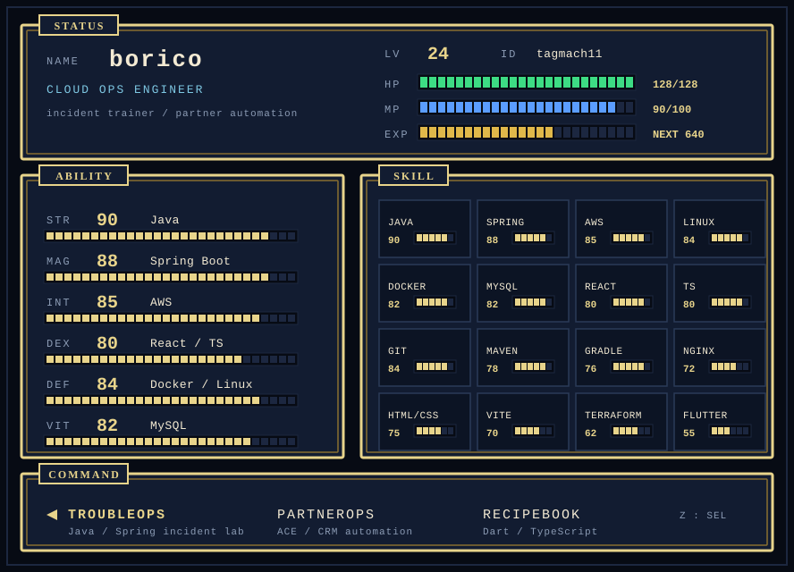

  

  <a href="https://github.com/tagmach11/TroubleOps">TroubleOps</a>
  &nbsp;·&nbsp;
  <a href="https://github.com/tagmach11/AWS_Billing_Automation">PartnerOps</a>
  &nbsp;·&nbsp;
  <a href="https://github.com/tagmach11/Recipebook">RecipeBook</a>

